# Login-Application

### Developed a Login Application using Python which has the following features

* Creates a New Account
	- Gets E-Mail Id as input and checks if account already exists in the database
	- If account doesn't exists, then a strong password is receieved as input and its hashed value is stored in the database using `SHA-256`
* Existing User Login
	- Gets E-Mail Id and Password as input and logs into the Dashboard
	- Under the Dashboard, user is provided with the following options:
		1. Change Account Password
		2. Delete Account

### Databases Used

* `SQLite`
	- Lightweight database that is created locally and used
	- Commands are similar to in MySQL, OracleSQL
	- Included with Python and can be used by using `import sqlite3`
* `Firebase`
	- A Realtime Database is created in Google's Firebase Database and information is used in the cloud with the help of API's
	- Data could be written and accessed with the help of secret API keys
	- NoSQL Database

### Required Modules

`pip install firebase_admin` - For Firebase Database

### How to create realtime database in Firebase

1. Create a New Project in Google's Firebase by clicking the icon `Add Project` 
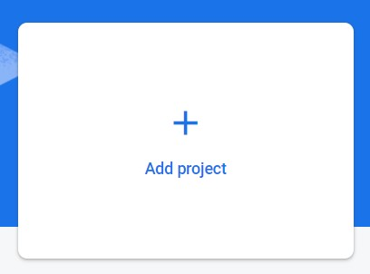 
2. Give a name for your project and click continue 
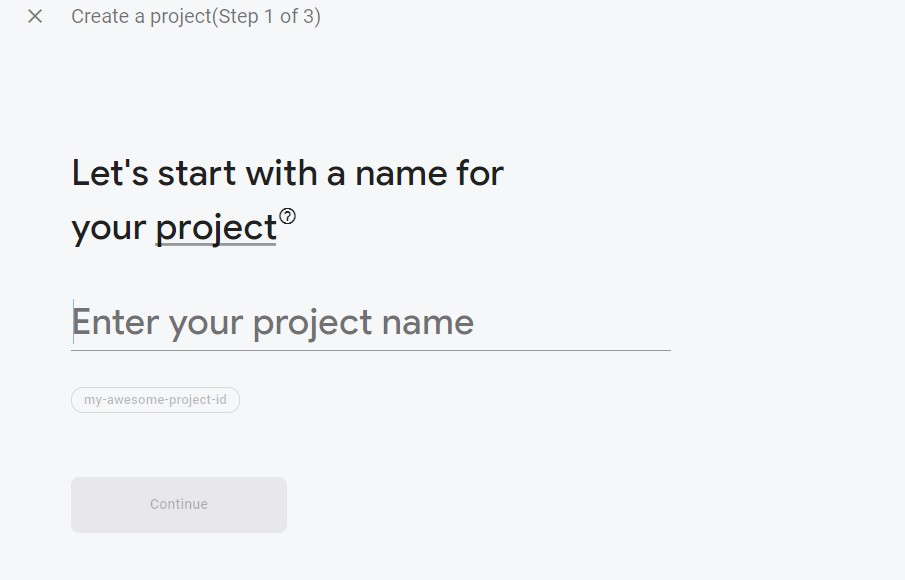 
3. Un-check the option `Enable Google Analytics for this project` and click `Create Project` 
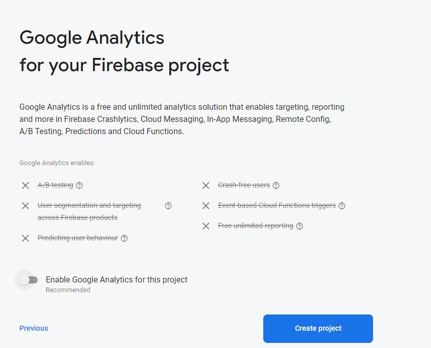 
4. Click the settings icon and open `Project Settings` 
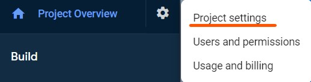 
5. Go to `Service Accounts` 
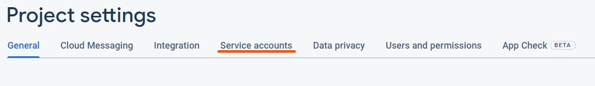 
6. Select the option `Python` and click `Generate new Private key`
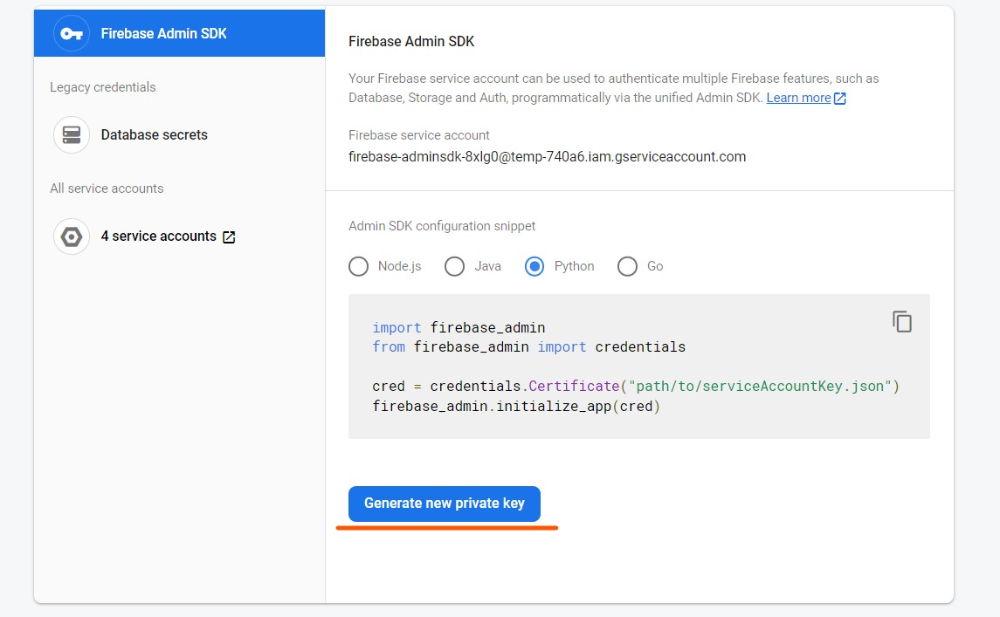 
7. Keep the downloaded file safely
8. Go to `Realtime Database`
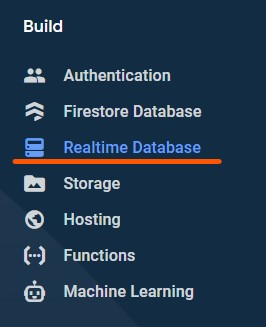 
9. Click on `Create Database`
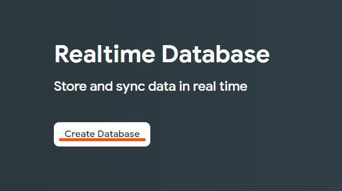 
10. Click on `Next`
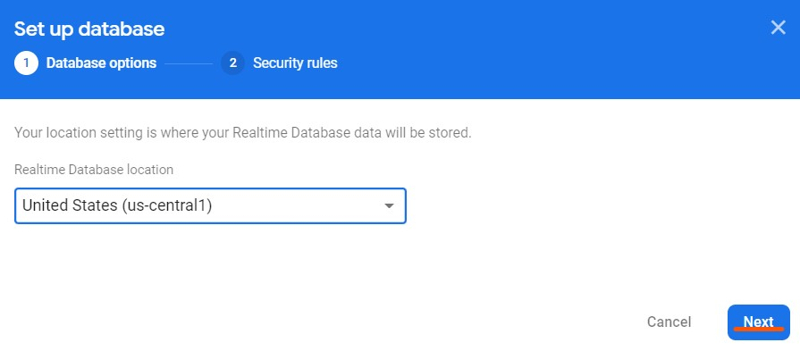 
11. Select the option `Start in test mode` and click on `Enable`
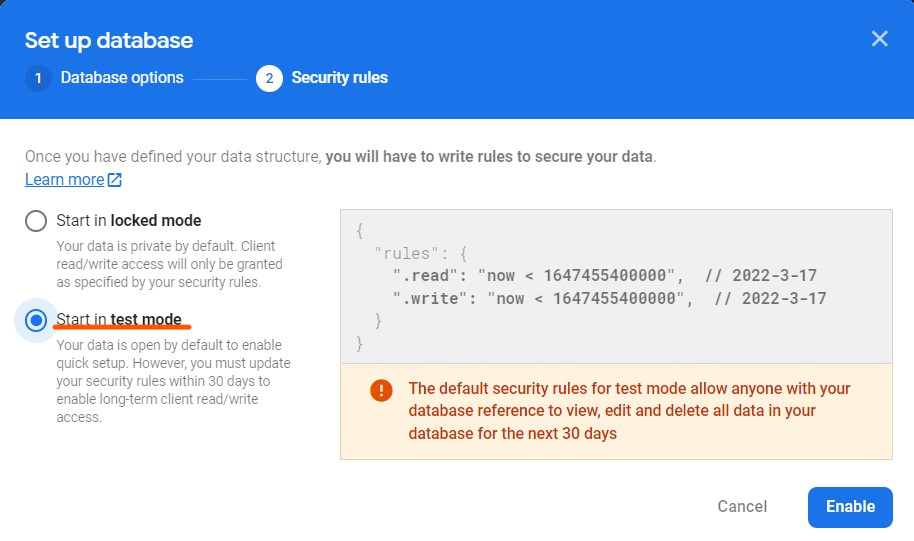 
12. Now the database has been created successfully. Any changes made using the API Key would get refelcted here
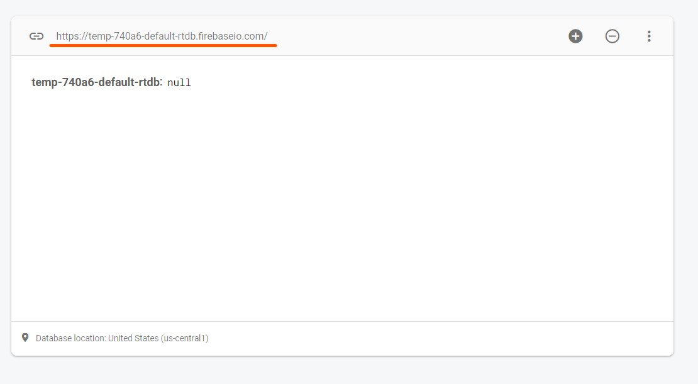 

 
 

### Useful Resources

Use this link to learn how to update records in Firebase - `https://www.freecodecamp.org/news/how-to-get-started-with-firebase-using`